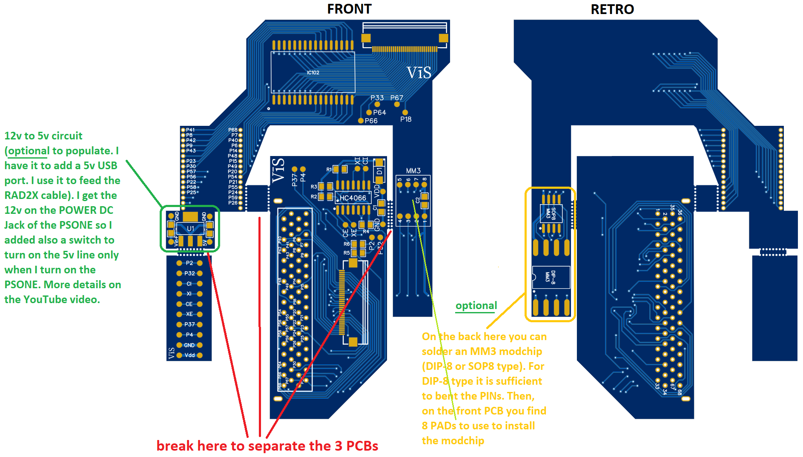

# Install-PSIO-on-PSone

This project allows you to add a **Parallel port** to the **PSone** in order to use a Cybdyn Systems's PSIO Cartridge by preserving also the CD-ROM drive. The parallel port must be sourced from a donor phat PS1 (this is the only drawback). The utility of this mod is to avoid to solder a PSIO cartdridge directly inside the console so if you have also a phat PSIO ready PS1 you can use PSIO on both. PSIO cartdridge can be purchased from the [Cybdyn Systems online store](https://psio.cybdyn-systems.com.au/store/psio-cartridge/). At the moment, this is the only way to play your PS1 games from an SD card preserving your CD-ROM drive without wiring a PSIO cart inside the PSone.

## Disclaimer

**This is a DIY project for electronic enthusiasts. For this reason, I am not responsible for any damage incurred while attempting this project or after completion of the project. You alone accept all risk since you are 100% liable for damage to yourself or your property. This is an unofficial mod so again, try this by knowing the risks.**

## Repo overview

The production file can be found on PCWay . 

An overwiev of the boards is shown in the following image.

So you have 3 PCBs directly into one file. I suggest you to produce PCBs with 0.8 mm thickness. To save money you can produce them in HASL but soldering the FPC connectors can be harder than the ENIG surface finish. So the choice is up to you.

## Instructions

The installation can be summarized as shown in the following image.

**I have used the PSone model A** but it should be ok also for model B (if someone confirm this to me I will update this part of the description).
The detailed installation is shown in the [setup video](https://youtu.be/x9w5lpTidZ8)

Ensure to enable the fast boot on the PSIO cartdridge since I remember that it works only with this option enabled (so enable it by using a phat PS1).

**How cut the double row PIN headers in order to have single row headers will be shown in a new video asap**.

## Gaskets

The "PSIO_PSone_gaskets.stl" file can be 3D printed. It contains the gaskets that you can use to refine the visible cutted parts of the shell.

## Bill of Materials

| Reference Designators    | Description  | Mfr. Part # | LCSC code | 
| ----------------------- | --------------------------------------------------------------------- | --------------------- | --------------------- |
| R1, R2, R3 | 10 kΩ 0805 resistor   | RC0805FR-0710KL          | C84376 |
| R4 | 47 kΩ 0805 resistor             | RC0805JR-0747KL | C131051|
| R5, R6 | 100 Ω 0805 resistor             | SWR05JTFV1000 | C412432|
| C1, C2 | 100 nF 50 V 0805 capacitor             | GRM21BR71H104KA01L | C77082|
| C3, C4 | 10 μF 16 V 0805 capacitor             | GRM21BR61C106KE15L | C77075|
| D1 | 30 V 2 A Schottky diode            | B230A-13-F | C12889|
| HC4066 | 30Ω 4 SPST Analog Switch           | SN74HC4066DR | C2869168|
| U1 | LDO 5 V 150 mA| NCV8664ST50T3G | C417290|
| FFC/FPC connector x 2| 32 PIN pitch 0.5 mm   | AFC01-S32FCA-00 | C262672|
| FFC/FPC cable| 32 PIN pitch 0.5 mm  10 cm length | - | -|
| PIN headers| double rows right angle pitch 1.27 mm | - | -|

FFC/FPC cable and PIN headers can be easily found on several shops. I suggest you LCSC, Aliexpress and so on. For example you can buy these:
- [Aliexpress PIN headers](https://www.aliexpress.com/item/1005003187603100.html) buy at least 2x20 type.
- [Aliexpress FPC/FFC 32 pin cable](https://www.aliexpress.com/item/32952887118.html) buy length 10 cm.

## Credits
  - [China TZMWX](https://www.youtube.com/watch?v=lZuWaWRO4Zg&ab_channel=ChinaTZMWX). I started from this project that explain how wire a PSIO inside a PSone.
  - [Cybdyn Systems](https://psio.cybdyn-systems.com.au/store/psio-cartridge/) that practically allowed me on Discord to share this project.
  - [Voultar](https://voultar.com/) that shared the PSIO circuit switchboard.
  - [ModeSelect](https://modeselect.neocities.org/) Discord user that have provided me the PSone board photos.

## License
 This work is licensed under a <a rel="license" href="http://creativecommons.org/licenses/by-sa/4.0/">Creative Commons Attribution-ShareAlike 4.0 International License</a>. You are able to copy and redistribute the material in any medium or format, as well as remix, transform, or build upon the material for any purpose (even commercial) - but you **must** give appropriate credit, provide a link to the license, and indicate if any changes were made.

## Support VIS projects

I have several stuffs in mind, but since developing these things has a high cost in materials and prototypes, a little [PayPal](https://www.paypal.com/donate/?hosted_button_id=LSQK3VE8Y6EE6) donation is appreciated.

## Contacts

**email**: vis.modding@gmail.com  

**discord**: you can find me as *vis_modding* on several servers (BennVenn, Mouse Bit Lab, Retrosix modding, Game Boy, Gameboy makers, Cybdyn Systems, Pixel FX Official Discord, Modded Gameboy Club).

